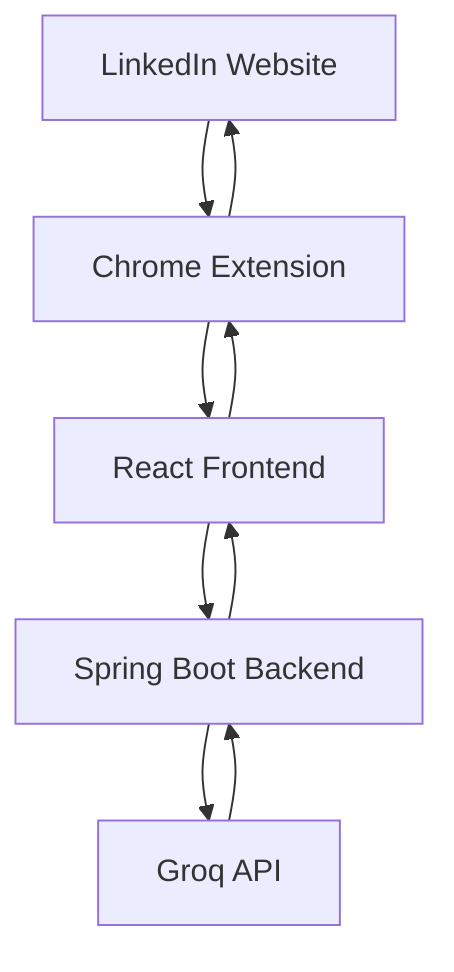

# 🚀 LinkUp AI

### AI-Powered LinkedIn Assistant | Spring Boot + React + Chrome Extension + Groq AI

LinkUp AI is a full-stack productivity platform that helps professionals, students, and job seekers generate high-quality LinkedIn messages instantly.

The system combines a Spring Boot backend, React frontend, Chrome Extension integration, and Groq-powered LLMs to automate professional communication workflows directly inside LinkedIn.

---

# 🎥 Demo Video

<p align="center">
  <a href="https://drive.google.com/file/d/1AX5lyAVrnhNZ1xDoS_78twR2Jn-2aCS3/view?usp=sharing">
    
  </a>
</p>

<p align="center">
🎬 Click the image above to watch the complete project demonstration
</p>

---

# 📸 Project Screenshots

## 🏠 Dashboard

<p align="center">
  
</p>

---

## 🤝 Referral Request Generator

<p align="center">
  
</p>

---

## 💼 Recruiter Outreach Generator

<p align="center">
  
</p>

---

## 💬 LinkedIn Reply Assistant

<p align="center">
  
</p>

---

## 🧩 Chrome Extension

<p align="center">
  
</p>

---

# 🎯 Project Vision

Modern networking requires sending:

* Referral Requests
* Recruiter Outreach Messages
* Connection Requests
* Follow-Ups
* Chat Replies

Most users struggle to write personalized and professional messages consistently.

LinkUp AI solves this by generating context-aware LinkedIn messages in seconds while maintaining a natural and professional tone.

---

# ✨ What Makes LinkUp AI Different

Unlike generic AI chat tools, LinkUp AI is specifically optimized for LinkedIn communication workflows.

The system understands:

* Referral networking etiquette
* Recruiter communication
* Professional follow-ups
* Connection request best practices
* Conversational LinkedIn replies

Each action uses dedicated prompt engineering and response optimization logic.

---

# 🚀 Core Features

## 🤝 Referral Request Generator

Generate professional referral requests tailored to:

* Company
* Employee Name
* Target Role
* Job Description

Features:

* Professional wording
* Personalized networking style
* Non-pushy communication
* High response-rate structure

---

## 💼 Recruiter Outreach Generator

Create recruiter messages that:

* Highlight relevant skills
* Show genuine interest
* Avoid generic templates
* Remain concise and professional

---

## 🔗 Connection Request Generator

Generate networking invitations that:

* Stay within LinkedIn limits
* Sound natural
* Encourage acceptance
* Build authentic connections

---

## 💬 Smart LinkedIn Reply Assistant

Paste an existing conversation and generate:

* Professional replies
* Follow-up responses
* Networking responses
* Recruiter responses

---

## ⚡ Fast Reply Mode

Optimized endpoint for near-instant responses.

Benefits:

* Reduced latency
* Faster AI generation
* Better extension experience

---

## 🎭 Dynamic Tone Control

Users can generate responses in multiple styles:

* Professional
* Friendly
* Confident
* Concise

The backend automatically adjusts prompt structure based on selected tone.

---

# 🧩 Chrome Extension Integration

LinkUp AI includes a Chrome Extension that works directly inside LinkedIn.

### Features

* LinkedIn DOM Detection
* Dynamic UI Injection
* Floating Assistant Panel
* One-Click Reply Generation
* Real-Time Content Extraction
* Fast AI Suggestions

Users can generate messages without leaving LinkedIn.

---

# 🏗️ Architecture



---

# 🛠️ Tech Stack

| Layer         | Technology         |
| ------------- | ------------------ |
| Frontend      | React              |
| UI Framework  | Material UI        |
| Backend       | Spring Boot        |
| API Client    | WebClient          |
| AI Provider   | Groq               |
| LLM Model     | Llama 3.3 70B      |
| Extension     | JavaScript         |
| HTTP Client   | Axios              |
| Validation    | Jakarta Validation |
| Serialization | Jackson            |
| Build Tool    | Maven              |

---

# ⚙️ Backend Engineering

The backend acts as a secure AI gateway.

### Responsibilities

* Prompt generation
* Action routing
* Tone handling
* Request validation
* Response parsing
* Error handling
* API security

### Implemented Using

* Spring Boot REST APIs
* DTO Architecture
* Validation Layer
* Service Layer Abstraction
* WebClient Integration

---

# 🎨 Frontend Engineering

The React frontend was optimized for usability and speed.

### Features

* Material UI Design
* Dark Mode
* Dynamic Forms
* Action-Based UI Rendering
* Loading States
* Error Handling
* Clipboard Support
* Animated Response Rendering

---

# ⚡ Performance Optimizations

Several optimizations were implemented during development.

### Smart Action Normalization

Frontend actions are converted into backend-safe action types.

```text
LinkedIn Follow-up
→ REFERRAL_REQUEST

Cold Pitch
→ COLD_PITCH

LinkedIn Reply
→ LINKEDIN_REPLY
```

This prevents invalid API requests.

---

### Fast Reply Endpoint

Created a dedicated endpoint for extension-based generation.

Benefits:

* Reduced response time
* Better user experience
* Lower frontend processing overhead

---

### Prompt Engineering Optimization

Custom prompts were created for each action.

This improved:

* Response quality
* Consistency
* Professional tone
* Networking effectiveness

---

### Frontend UX Improvements

Optimizations include:

* Dynamic form rendering
* Input validation
* Auto-reset states
* Improved loading indicators
* Cleaner response display

---

# 🔐 Security Improvements

## API Key Protection

One major engineering challenge was protecting AI credentials.

Improvements:

* Removed exposed API keys
* Migrated secrets to environment variables
* Backend-only API access
* Prevented frontend key exposure

Example:

```properties
groq.api.key=${GROQ_API_KEY}
```

---

## GitHub Secret Protection

Implemented secure repository practices:

* Secret scanning compliance
* Credential removal from Git history
* Environment-based configuration

---

## Request Validation

Input validation prevents:

* Invalid requests
* Missing fields
* Improper action types

---

# 🧪 Testing & Debugging

During development several issues were identified and resolved.

### Spring Boot Test Configuration

Resolved:

* Missing MockMvc dependencies
* Test context failures
* Maven build issues

---

### Maven Dependency Cleanup

Fixed:

* Duplicate dependencies
* Dependency conflicts
* Spring Boot test setup

---

### Frontend-Backend Integration

Resolved:

* Endpoint mismatches
* Action mapping errors
* API response handling issues

---

### Chrome Extension Stability

Improved:

* DOM detection
* Injection reliability
* LinkedIn compatibility

---

# 📊 Supported Workflows

| Workflow            | Status |
| ------------------- | ------ |
| Referral Requests   | ✅      |
| Recruiter Outreach  | ✅      |
| Connection Requests | ✅      |
| Chat Replies        | ✅      |
| Follow-Ups          | ✅      |
| Fast Replies        | ✅      |

---

# ⚙️ Installation

## Clone Repository

```bash
git clone https://github.com/prijithjohn/linkup.git
cd linkup
```

---

## Backend Setup

Create:

```properties
src/main/resources/application.properties
```

Add:

```properties
server.port=8086

groq.api.url=https://api.groq.com/openai/v1/chat/completions
groq.api.key=YOUR_GROQ_API_KEY
```

Run Backend:

```bash
mvn spring-boot:run
```

Backend runs on:

```text
http://localhost:8086
```

---

## Frontend Setup

```bash
cd frontend

npm install

npm run dev
```

---

## Chrome Extension Setup

1. Open Chrome

2. Go to:

```text
chrome://extensions
```

3. Enable Developer Mode

4. Click Load Unpacked

5. Select the extension folder

6. Open LinkedIn and start using LinkUp AI

---

# 🚀 Future Roadmap

* Resume Analyzer
* Job Description Matching
* ATS Resume Review
* AI Networking Coach
* Saved Templates
* User Authentication
* Cloud Deployment
* Docker Support
* Analytics Dashboard
* Team Collaboration Features

---

# 💡 Engineering Skills Demonstrated

✅ Full Stack Development

✅ Spring Boot Backend Development

✅ React Frontend Engineering

✅ Chrome Extension Development

✅ REST API Design

✅ Prompt Engineering

✅ AI Integration

✅ Security Best Practices

✅ Maven Dependency Management

✅ Testing & Debugging

✅ System Design

✅ Product Development Thinking

---

# 👨‍💻 Author

## Prijith John

Computer Science Engineer

### Areas of Interest

* Full Stack Development
* Backend Engineering
* AI Applications
* Product Development
* Chrome Extensions
* Software Architecture

---

# ⭐ Conclusion

LinkUp AI is more than a message generator.

It is a practical productivity platform that combines AI, full-stack engineering, browser extensions, and prompt engineering to solve a real-world networking problem.

The project demonstrates end-to-end product development—from backend architecture and frontend experience to browser automation, AI integration, security, testing, performance optimization, and deployment readiness.

If you found this project interesting, consider giving it a ⭐ on GitHub.
