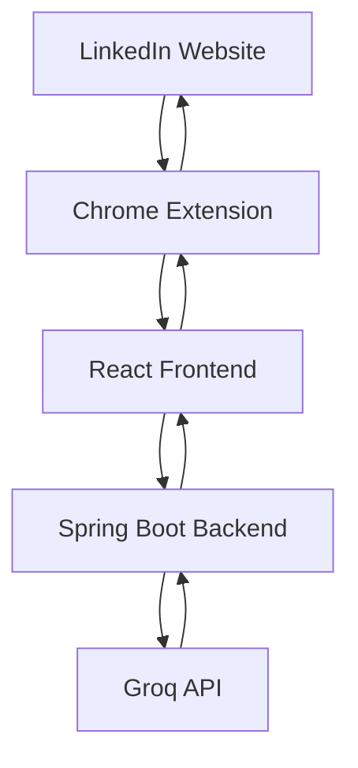

# 🚀 LinkUp AI

### AI-Powered LinkedIn Assistant | Spring Boot + React + Chrome Extension

Generate professional LinkedIn replies, referral requests, recruiter outreach messages, follow-ups, and connection requests instantly using AI.

---

# 🎥 Demo Video

<p align="center">
  <a href="YOUR_DEMO_VIDEO_LINK">
    
  </a>
</p>

<p align="center">
📌 Click the image above to watch the full demo
</p>

---

# 📸 Project Preview

## 🏠 Main Dashboard

<p align="center">
  
</p>

---

## 🤝 Referral Request Generator

<p align="center">
  
</p>

---

## 💼 Recruiter Outreach Generator

<p align="center">
  
</p>

---

## 🧩 LinkedIn Chrome Extension

<p align="center">
  
</p>

---

# 🚀 Why This Project Matters

Networking is one of the most important parts of modern job searching.

Most candidates struggle with:

### ❌ Writing Referral Requests

People don't know how to ask professionally.

### ❌ Messaging Recruiters

Cold messages often sound generic or desperate.

### ❌ Following Up

Candidates hesitate because they don't know what to say.

### ❌ Standing Out

Most LinkedIn messages look copied and robotic.

LinkUp AI helps users generate natural, professional, and personalized LinkedIn messages instantly.

---

# ✨ Key Features

## ⚡ AI Message Generation

Generate LinkedIn messages in seconds.

Supported message types:

* Referral Requests
* Connection Requests
* Follow-Up Messages
* Recruiter Outreach
* Networking Messages
* Custom LinkedIn Replies

---

## 🎯 Smart Tone Selection

Choose different communication styles:

* Professional
* Friendly
* Confident
* Formal
* Casual
* Enthusiastic
* Persuasive
* Respectful

---

## 🤝 Referral Request Engine

Specialized prompting ensures:

* User asks for a referral
* AI never assumes recipient is applying
* Professional and respectful wording
* Natural networking style

---

## 💼 Recruiter Outreach Generator

Create concise recruiter messages that:

* Highlight relevant skills
* Show genuine interest
* Avoid sounding desperate
* Improve response rates

---

## ⚡ Fast Reply Mode

Chrome Extension mode optimized for:

* Instant responses
* Minimal latency
* One-click message generation

---

## 🌐 Chrome Extension Integration

Directly works inside LinkedIn.

### Features

* DOM Injection
* Floating Assistant Panel
* Dynamic LinkedIn Detection
* One-Click AI Generation
* Real-Time Messaging Support

---

# 🧱 System Architecture



---

# 🛠️ Tech Stack

| Layer        | Technology         |
| ------------ | ------------------ |
| Frontend     | React.js           |
| UI           | Material UI        |
| Backend      | Spring Boot        |
| API Client   | WebClient          |
| AI Provider  | Groq               |
| LLM          | Llama 3.3 70B      |
| Extension    | JavaScript         |
| HTTP Client  | Axios              |
| Validation   | Jakarta Validation |
| JSON Parsing | Jackson            |
| Build Tool   | Maven              |

---

# 🧠 Supported Actions

| Action             | Purpose                     |
| ------------------ | --------------------------- |
| Referral Request   | Ask employees for referrals |
| Connection Request | Send networking invitations |
| Recruiter Outreach | Contact recruiters          |
| Follow-Up Message  | Follow up professionally    |
| Fast Reply         | Instant LinkedIn responses  |
| Custom Message     | User-defined communication  |

---

# 🔐 Security Features

## API Key Protection

* API keys stored on backend
* No secrets exposed to frontend
* Backend acts as secure gateway

---

## Input Validation

* Request validation
* Error handling
* Safe response parsing

---

## Prompt Safety

* Controlled prompt templates
* Consistent output formatting
* Action-specific AI behavior

---

# ⚙️ Installation

## Clone Repository

```bash
git clone https://github.com/prijithjohn/linkup-ai.git
cd linkup-ai
```

---

## Backend Setup

Create:

```properties
application.properties
```

Add:

```properties
server.port=8086

groq.api.url=https://api.groq.com/openai/v1/chat/completions
groq.api.key=YOUR_GROQ_API_KEY
```

Run backend:

```bash
./mvnw spring-boot:run
```

---

## Frontend Setup

```bash
cd frontend

npm install

npm run dev
```

---

## Chrome Extension Setup

1. Open Chrome

2. Navigate to:

```text
chrome://extensions
```

3. Enable Developer Mode

4. Click Load Unpacked

5. Select extension folder

---

# 📌 Future Roadmap

* [ ] Resume Analyzer
* [ ] Job Description Matching
* [ ] Multi-Language Support
* [ ] LinkedIn Profile Review
* [ ] AI Networking Coach
* [ ] Saved Templates
* [ ] User Authentication
* [ ] Cloud Deployment
* [ ] Docker Support
* [ ] Analytics Dashboard

---

# ⭐ What Makes This Project Stand Out

This project demonstrates:

✅ AI Integration

✅ Full Stack Development

✅ Prompt Engineering

✅ Spring Boot Backend Design

✅ Chrome Extension Development

✅ LinkedIn Workflow Automation

✅ API Security Practices

✅ Real-World Productivity Tool

✅ Modern React Development

---

# 🧪 Engineering Challenges Solved

During development:

* Groq API integration
* Secret management
* Prompt engineering refinement
* LinkedIn DOM manipulation
* Spring Boot API architecture
* Chrome Extension communication
* Error handling and debugging
* Frontend-backend synchronization

---

# 📊 Performance Goals

⚡ Fast AI Generation

🎯 High-Quality Professional Messages

🤝 Better Networking Efficiency

💼 Improved Job Search Communication

🌐 Seamless LinkedIn Integration

---

# 👨‍💻 Author

## Prijith John

Computer Science Engineer

Interested in:

* Full Stack Development
* AI Applications
* Backend Engineering
* Chrome Extensions
* Product Development

---

# 📬 Connect With Me

<p align="left">
  <a href="https://github.com/prijithjohn">GitHub</a> •
  <a href="https://www.linkedin.com/in/prijith-john-dev">LinkedIn</a>
</p>

---

# ⭐ Support

If you found this project useful, consider giving it a ⭐ on GitHub.
